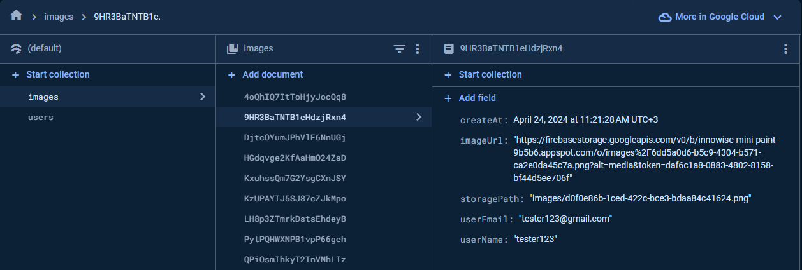

# innowise-lab-internship-mini-paint

1. **Task**:
https://drive.google.com/file/d/19cb4whI_HUVPzuaPyaj5r6hGotIVnhho/view

2. **Deploy**:
https://innowise-lab-internship-mini-paint.vercel.app/

3. **How to run the app**: 
    1. To run it locally, just download this repo as a zip
    2. Unzip it and run npm install in the project folder.
    3. To start in dev mode, use npm start
    4. To build it, use npm run build - script will create a "dist" folder with all files that you need.

4. **Database snapshot**:

   

5. **Application stack**: 
    - React + TypeScript + RTK - as frontend
    - Firebase - as backend
    - Material UI - as UI library
    - React-hook-form and Yup for validation
    - React-router-dom for routing
    - Vite - as bundler
    - Eslint + Prettier - as code styler
    - Husky - git hooks

    
